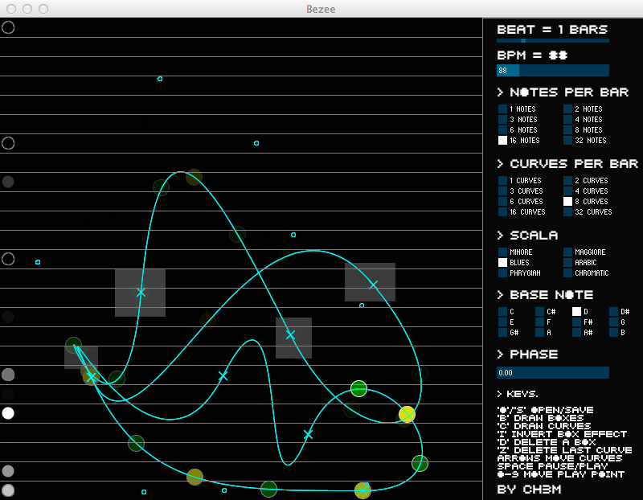

Bezee
=========

Bezee is a note sequencer based on Bezier curves. Draw a sequence of curves,
and play them, like keys on a scale!

You will find ready-made, stand-alone Mac, Linux and Windows app in the [Release
section](../../releases/).

If you instead wish to build it from source, you will need:

* [Processing](https://processing.org/)
* [SoundCipher](http://explodingart.com/soundcipher/), a music and sound library for Processing
* [controlP5, a GUI library for Processing](http://www.sojamo.de/libraries/controlP5/)

Examples
--------
op
You can find some examples i made in Bezee in the directory `examples`. To read
these files, open Bezee and press "o" to open a file.
